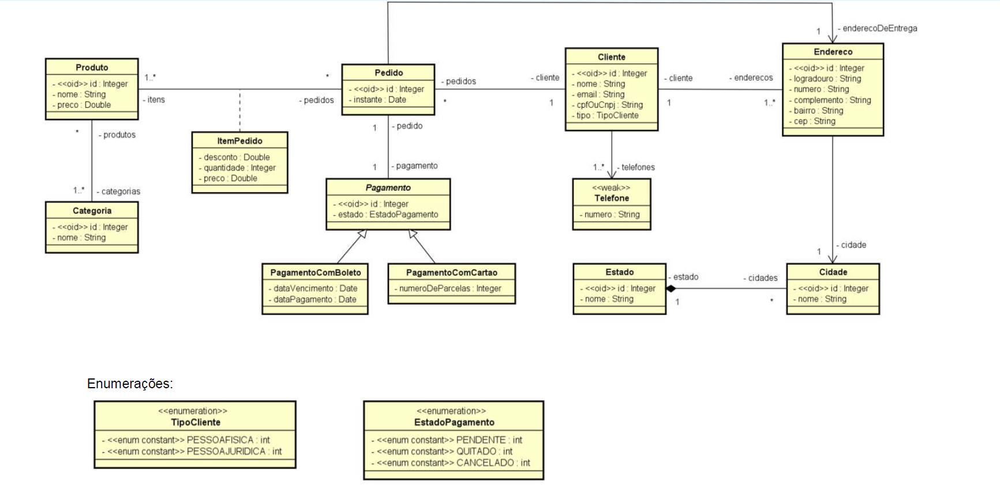
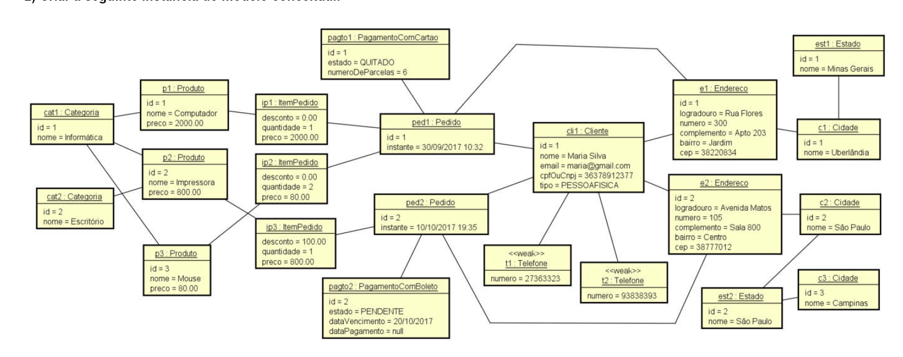
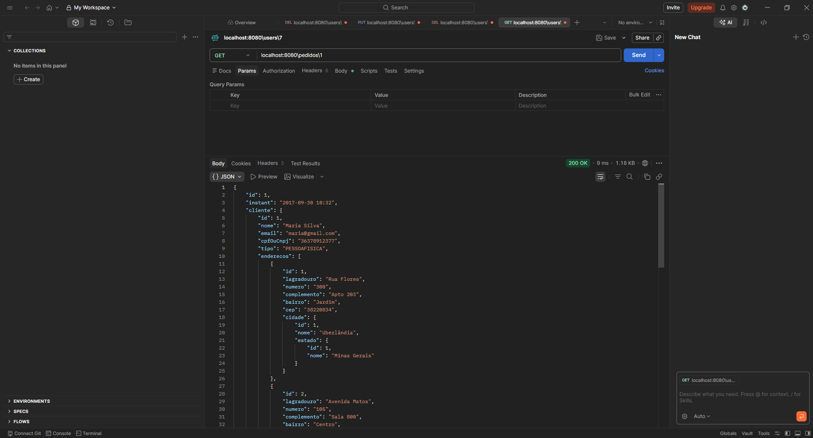
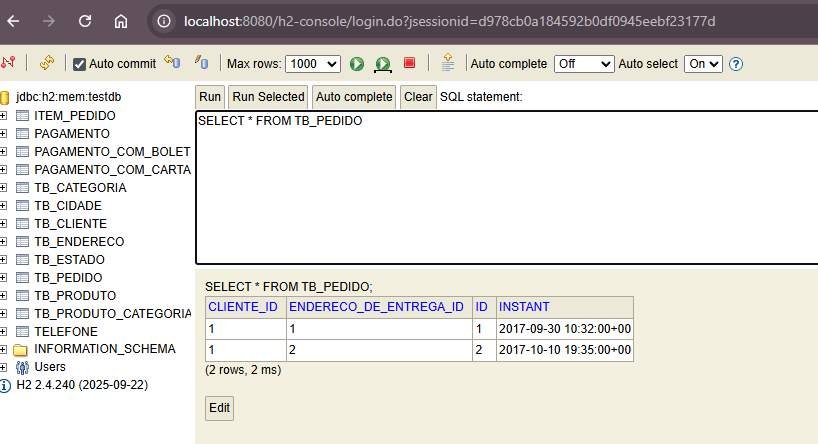

# Estudo de caso: implementação Java com Spring Boot e JPA
[](LICENSE) 

# Sobre o projeto

1 - Estudo de caso com objetivo de mostrar na prática como um modelo conceitual pode ser implementado
sobre o paradigma orientado a objetos, usando padrões de mercado e boas práticas.

Foi utilizado um modelo conceitual abrangente, com o qual possamos mostrar a implementação prática
em linguagem orientada a objetos dos tópicos aprendidos no curso, quais sejam:
- Leitura e entendimento do diagrama de classes
- Leitura e entendimento do diagrama de objetos
- Associações
- Um para muitos / muitos para um
- Um para um
- Muitos para muitos
- Conceito dependente
- Classe de associação
- Herança
- Enumerações
- Tipos primitivos (ItemPedidoPK)
- Entidades fracas (ElementCollection)
- Associações direcionadas

2- Gerar uma base de dados relacional automaticamente a partir do modelo conceitual, bem como povoar a base com a instância dada.

3- Recuperar os dados e disponibilizá-los por meio de uma API Rest BÁSICA. Os seguintes end points devem ser disponibilizados:
| End point | Dados |
| :---: | :---: |
| /categorias/{id} | Categoria e seus produtos |
| /clientes/{id} | Cliente, seus telefones e seus endereços |
| /pedidos/{id} | Pedido, seu cliente, seu pagamento, seus itens de pedido, seu endereço de entrega |

## Modelo Conceitual


## Instância do modelo conceitual


## Exemplo de teste de End point no Postman


## Base de dados no Banco de teste H2
 

# Tecnologias utilizadas
## Back end
- Java
- Spring Boot
- JPA / Hibernate
- Maven
## Testes
- Postman
- Banco de dados H2

# Como executar o projeto

## Back end
Pré-requisitos: Java 25

```bash
# clonar repositório
git clone https://github.com/welintonz226/Estudo-caso-uml-spring-jpa.git

# entrar na pasta do projeto

# executar o projeto
./mvnw spring-boot:run
```
# Agradecimentos
Professor Nélio Alves

# Autor
Welinton de Matos Azevedo
https://www.linkedin.com/in/welinton-de-matos-azevedo-3053b3a2/


